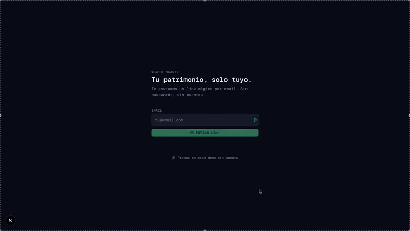
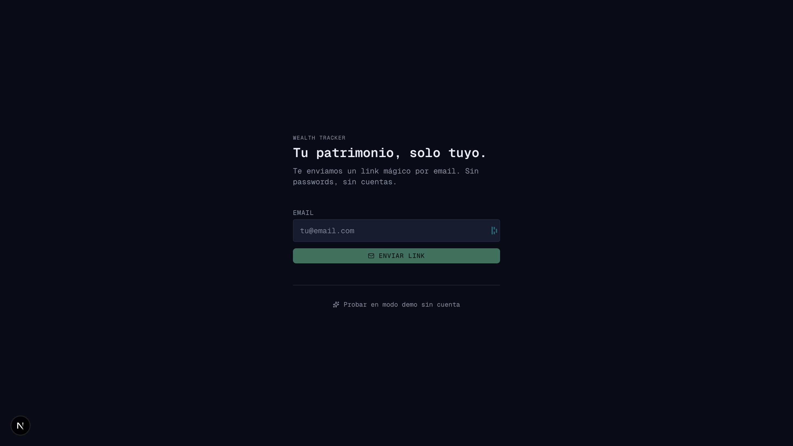
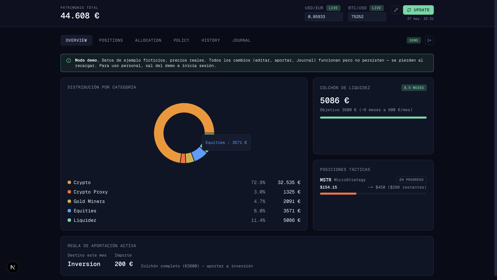
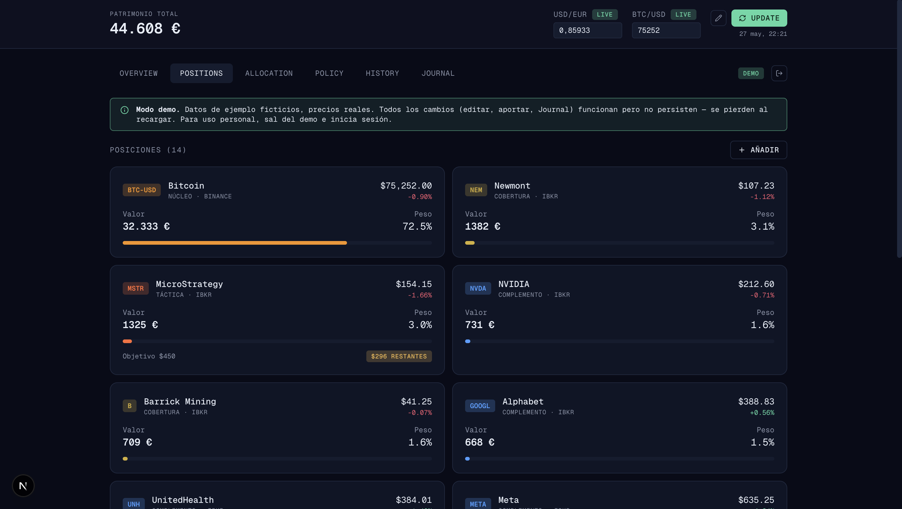
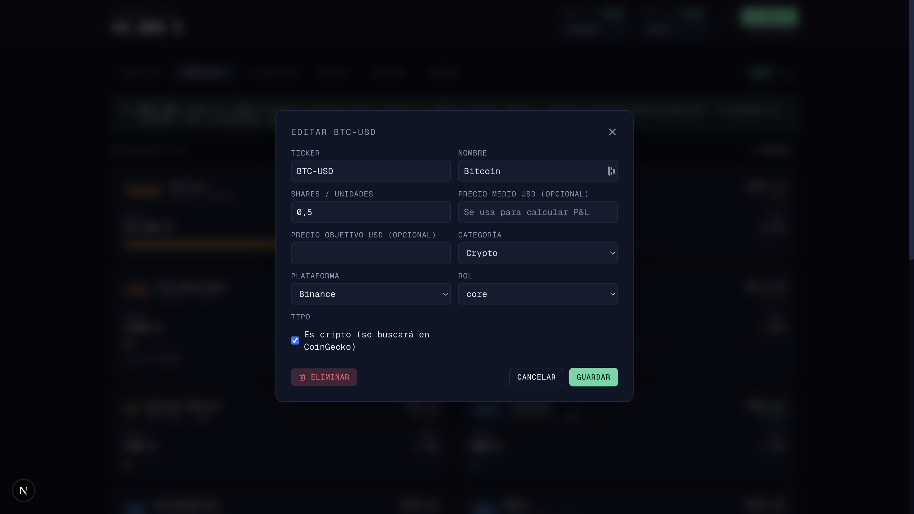
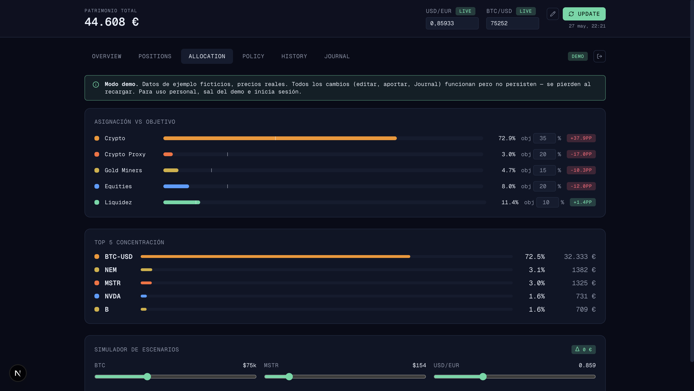
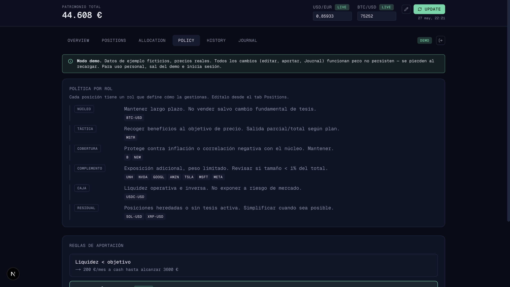
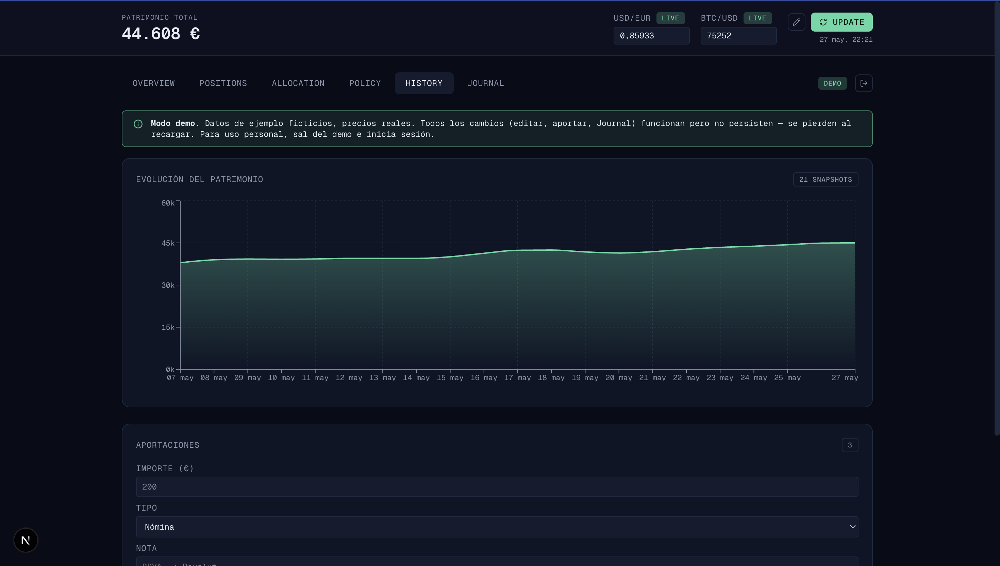
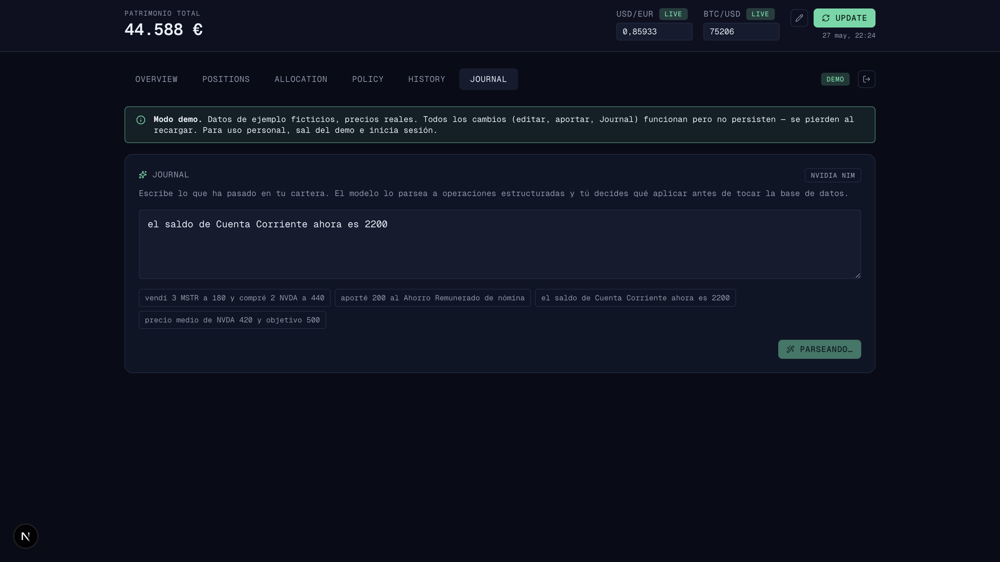

# Wealth Tracker

Personal net-worth dashboard. Bring-your-own Supabase, self-hostable in
minutes. Multi-user with magic-link auth, no signup forms. Live prices without
API keys. Natural-language journaling powered by an LLM.



Built as a personal tool and as a portfolio piece. The UI is in Spanish — the
underlying code, schema and docs are in English.

## Three ways to use it

- 🧪 **Public demo (no signup)** → [**wealth-tracker-liart.vercel.app/demo**](https://wealth-tracker-liart.vercel.app/demo)
  Fictitious data, real prices. All interactions work — nothing persists. No
  account required.

- 🟢 **Hosted instance with your own data** → [**wealth-tracker-liart.vercel.app**](https://wealth-tracker-liart.vercel.app)
  Sign in with a magic link to your email. Your rows live in this project's
  Supabase, isolated from every other user via row-level security (see
  [Security model](#security-model) — and especially the trust trade-off if
  you use my deployment instead of your own).

- 🛠️ **Self-host** → fork this repo and follow [Self-host](#self-host-5-minutes)
  below. Full data sovereignty: your Supabase, your Vercel, your control.

---

## Why this exists

Off-the-shelf trackers force you to either upload broker statements (privacy
hostile) or pick from a tiny set of categories that don't match how you
actually think about your portfolio. This app does neither: you own the
database, you define the positions, and prices come from public feeds.

It's opinionated about workflow (snapshot-on-update, role-tagged positions,
liquidity-target rules) and unopinionated about what you hold — start with a
template or from scratch.

---

## Features

- 🔒 **Multi-tenant magic-link auth.** Each user only sees their own rows
  (Postgres RLS scoped to `auth.uid()`). No passwords, no signup form.
- 📈 **Live prices, zero API keys.** CoinGecko (crypto), Stooq (US stocks),
  Frankfurter ECB rates (USD↔EUR). All free public endpoints.
- 🧠 **Natural-language Journal.** Type _"sold 3 MSTR at 180, contributed 200
  to savings from payroll"_ → the app parses it into structured operations
  you can review and apply.
- 💰 **Interest accrual** on cash accounts. The app tracks days elapsed ×
  annual rate; you confirm before persisting.
- 📊 **Six tabs:** Overview · Positions · Allocation (with scenario sliders) ·
  Policy · History · Journal.
- 🎨 **Dark monospace UI**, responsive down to mobile.
- 🪟 **Public `/demo` route** with fictitious data + real prices. All
  interactions work but nothing persists. No auth required.

---

## Screenshots

### Login
Magic link only — type your email, click the link in your inbox, you're in.



### Overview
At-a-glance net worth + category breakdown, liquidity cushion vs target,
tactical positions with their exit progress, and the active contribution rule.



### Positions
One card per holding. Click to edit shares, average price, target, role, etc.
P&L lights up automatically once you fill in `avg_price_usd`.





### Allocation
Current vs target per category (editable inline), top-5 concentration, and a
scenario simulator with sliders for BTC / MSTR / USD-EUR to preview drawdowns
and upside.



### Policy
Positions grouped by role with a default rule per role. Price alerts section
for every position that has a `target_price_usd`.



### History
Net-worth evolution from every `UPDATE` snapshot. Contributions logged
manually or via the Journal show up below.



### Journal (NVIDIA NIM)
Free-text input parsed by Llama 3.3 70B into structured operations. Nothing
hits the DB without your explicit confirmation.



---

## Stack

- **Framework:** Next.js 16 (App Router) + TypeScript + Tailwind v4
- **DB & auth:** Supabase (Postgres + Auth magic link)
- **Charts:** Recharts
- **Icons:** Lucide
- **Prices:** CoinGecko · Stooq · Frankfurter (no API keys)
- **LLM (optional):** NVIDIA NIM hosted inference (Llama 3.3 70B)
- **Hosting:** Vercel (zero-config deploy from this repo)

---

## Self-host (5 minutes)

### 1. Clone and install

```bash
git clone https://github.com/carleondel/wealth-tracker
cd wealth-tracker
npm install
```

### 2. Create a Supabase project

1. Go to [supabase.com](https://supabase.com) → New project.
2. **SQL Editor** → new query → paste `supabase/schema.sql` → Run.
3. Run each migration in order: `supabase/migrations/001_*.sql`,
   `002_*.sql`, `003_*.sql`.
4. **Authentication → URL Configuration:** add `http://localhost:3000/**` to
   Redirect URLs. Set Site URL to `http://localhost:3000` (or your Vercel
   URL once deployed).
5. **Authentication → Providers → Email:** make sure Email is enabled.
   "Confirm email" can stay off for the magic-link flow.
6. **Project Settings → API:** copy your `Project URL` and the
   `publishable` key.

### 3. Configure environment

```bash
cp .env.example .env.local
```

Fill in:
- `NEXT_PUBLIC_SUPABASE_URL`
- `NEXT_PUBLIC_SUPABASE_ANON_KEY` (the `publishable` key works; the legacy
  JWT anon key also works)
- `NVIDIA_API_KEY` *(optional — only the Journal tab needs it.
  [Get one free](https://build.nvidia.com))*

### 4. Run

```bash
npm run dev
```

Open [http://localhost:3000](http://localhost:3000), enter your email, click
the magic link in your inbox, then pick a template on the empty dashboard.

### 5. Deploy

Push to GitHub, connect Vercel to the repo, paste the same env vars into the
project settings. Magic link works the same in production — just remember to
add the production URL to Supabase's Redirect URLs.

---

## Templates included

When a new user signs in, they pick one of three starting tesis (or start
empty):

| Template | Style | Positions |
|---|---|---|
| **Crypto-first** | BTC core, MSTR tactical, gold miners hedge, megacap tech | 14 |
| **Index ETF** | Bogleheads-style passive 4-fund | 4 (VOO, VXUS, BND, VNQ) |
| **Dividend Income** | Dividend ETFs + aristocrats | 6 (SCHD, VYM, JEPI, O, KO, T) |

All numbers are fictitious. Edit any position via the UI to make it yours —
no SQL required.

---

## Security model

- **Per-user isolation.** Every table has an `owner_id uuid references
  auth.users(id)` column. Row-level security policies enforce
  `auth.uid() = owner_id` on every read and write. A user cannot read or
  modify another user's rows even if they guess IDs.
- **Public anon key is by design.** Supabase's anon/publishable key ships in
  the browser bundle. Security comes from RLS, not from hiding the key.
- **Server secrets** (NVIDIA key) live in `.env.local` and never leave the
  Next.js server. The `/api/journal` route is the only place that uses it.
- **No analytics, no tracking, no telemetry.** The app talks to your Supabase
  and the public price feeds, nothing else.
- **Your data lives in your Supabase project.** This repo is just the UI.

### Using the hosted instance

If you use [wealth-tracker-liart.vercel.app](https://wealth-tracker-liart.vercel.app)
instead of self-hosting, be aware of the trade-off:

- **Your rows are isolated from other users.** Row-level security blocks
  other accounts from reading or writing your data through the app.
- **The project owner (me) has full DB access** as the Supabase admin. I
  don't read your data, but I technically could. Same situation as any
  hosted SaaS.
- **If I stop paying or get bored**, the deployment can go down. You'd lose
  access (your data still exists in the DB, but no UI to it).
- **No SLA, no support, no backups guaranteed.** It's a portfolio
  deployment, not a product.

If any of that bothers you, self-host. The five-minute guide above gives you
your own Supabase and your own Vercel, and the app behaves identically.

---

## Project structure

```
app/
  layout.tsx
  page.tsx                   # auth gate (login vs dashboard)
  demo/page.tsx              # public demo, in-memory state
  api/prices/route.ts        # CoinGecko + Stooq + Frankfurter
  api/journal/route.ts       # NVIDIA NIM → structured ops
components/
  dashboard.tsx              # state + handlers (live + demo)
  login-screen.tsx
  header.tsx
  update-prices-modal.tsx
  edit-position-modal.tsx
  edit-asset-modal.tsx
  tabs/{overview,positions,allocation,policy,history,journal}.tsx
  ui/{card,badge,button,progress}.tsx
lib/
  supabase.ts                # browser client
  types.ts                   # TS types for DB rows
  policy.ts                  # POLICY constants + category colors/targets
  calculations.ts            # P&L, breakdown, deviation, accrued interest
  format.ts                  # money/percent formatters
  seed.ts                    # 3 templates with fictitious data
  demo.ts                    # synthetic snapshots for /demo
  journal-ops.ts             # Op types, validator
supabase/
  schema.sql
  migrations/
    001_snapshots_prices.sql
    002_multi_tenant.sql
    003_asset_interest.sql
```

---

## Roadmap

- [ ] Per-user policy settings (liquidity target, monthly contribution) editable from UI
- [ ] User-defined categories (today: 5 fixed enum values)
- [ ] CSV export
- [ ] Mobile-optimised PWA install
- [ ] Optional Touch/Face ID gate on top of magic link

---

## Contributing

This is a personal project published as a portfolio piece. Issues and PRs are
welcome but scope is intentionally narrow — feel free to fork freely.

---

## License

MIT
