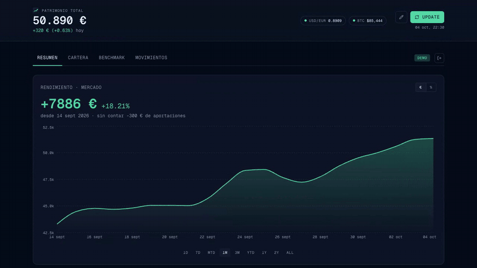
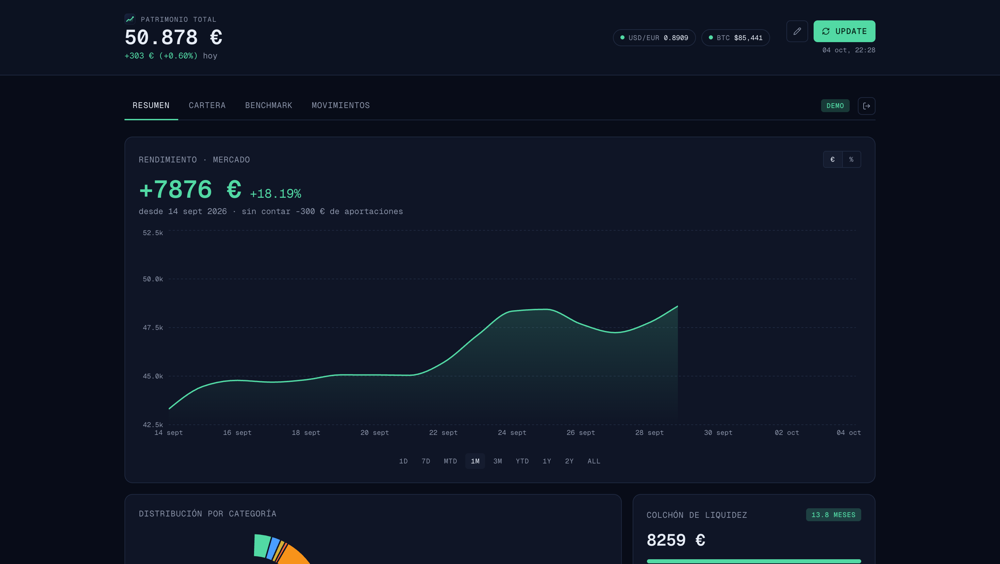
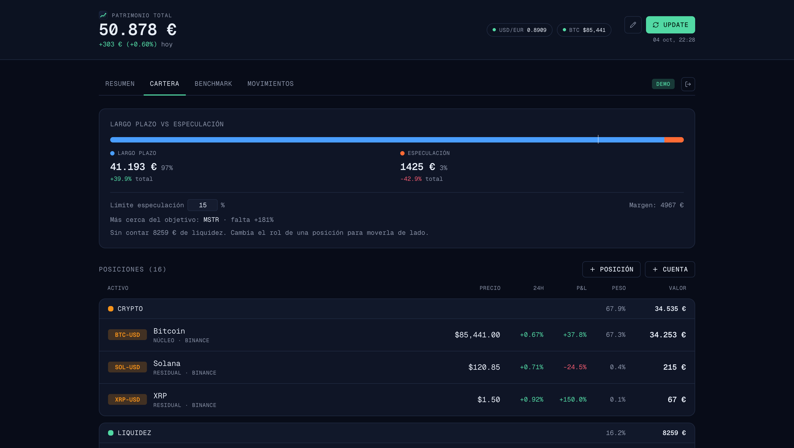
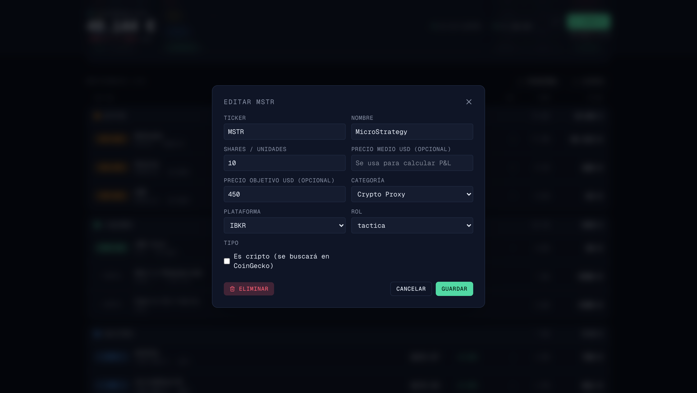
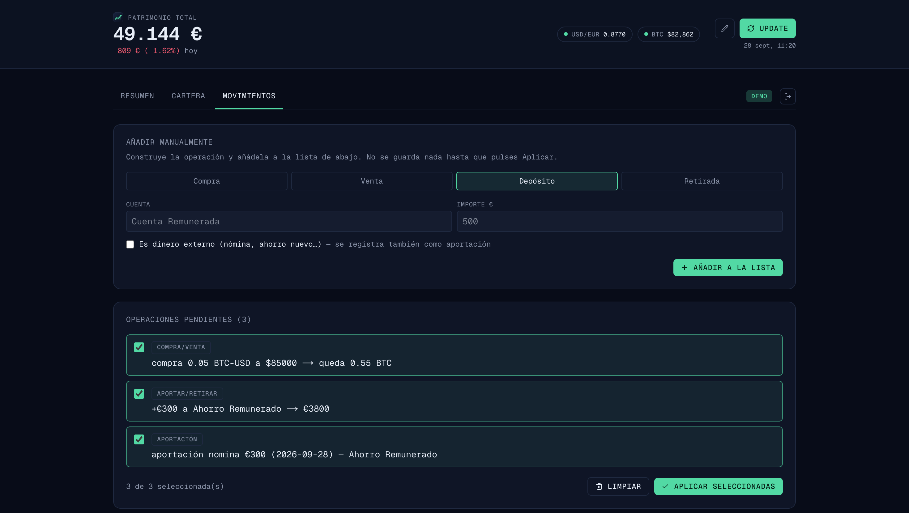
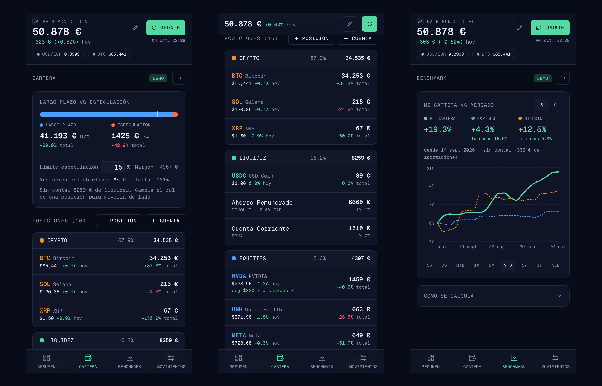
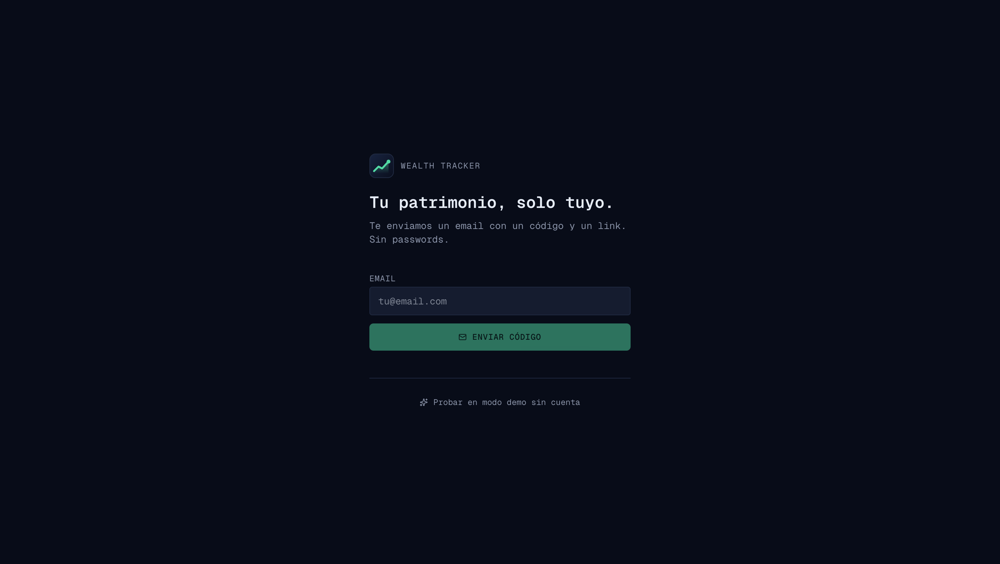

<div align="center">

# Wealth Tracker

**A private, self-hostable net-worth dashboard for people who hold crypto,
stocks and cash — and want to see all of it in one place.**

[**Live demo**](https://wealth-tracker-liart.vercel.app/demo) ·
[Hosted app](https://wealth-tracker-liart.vercel.app) ·
[Self-host](#self-host-in-5-minutes)



</div>

Bring your own Supabase, sign in with a one-time code, and track every
position with live prices from free public APIs — no broker linking, no
statement uploads. Built as a personal tool and as a portfolio piece: the UI
is in Spanish, code, schema and docs are in English.

---

## Highlights

- **Performance first.** The home screen opens with market P&L for the
  selected range (1D → ALL) and the net-worth evolution chart right below,
  in € or %. Contributions are excluded, so you see what the market did —
  not what you deposited.
- **One portfolio view.** Allocation vs target per category, then every
  position and cash account in compact rows grouped by category: price, 24h,
  P&L, weight and value.
- **A plan, not just numbers.** Liquidity cushion vs target, this month's
  contribution rule, and progress towards every price target.
- **Scenario simulator.** Drag BTC, MSTR or USD/EUR and see your net worth
  move.
- **Journal with review step.** Queue buys, sells, deposits and withdrawals;
  nothing touches the database until you apply them. External money is
  logged as a contribution so it never inflates performance.
- **Interest accrual** on savings accounts, applied with one click.
- **Live prices from free APIs.** CoinGecko for crypto and Frankfurter (ECB)
  for USD/EUR need no key; Finnhub (free key) covers US stocks. Prices are only fetched when
  you press `UPDATE`, and every update stores a snapshot.
- **Passwordless and multi-tenant.** Email one-time code (or magic link);
  Postgres row-level security isolates every user's rows.
- **Installable.** Add it to your phone's home screen and it runs full-screen
  with its own icon. The layout is designed for mobile first.
- **Public demo** with fictitious holdings and real prices. Everything works,
  nothing persists.

---

## Screenshots

### Resumen
Market performance, evolution chart, category breakdown, liquidity cushion
and plan.



### Cartera
Positions and accounts grouped by category. Tap any row to edit it.





### Movimientos
Build operations from a form, review them, apply them in one go. The
contribution history lives below.



### Mobile



### Login
Email → one-time code. The code works inside the installed home-screen app,
where magic links can't (iOS gives it separate storage from Safari).



---

## How it works

| Concept | What it means |
|---|---|
| **Positions** | Tickers you hold: shares, optional average price (enables P&L), optional target price, category, platform and role. |
| **Accounts** | Cash or savings balances in EUR, with an optional annual rate for interest accrual. |
| **Snapshots** | Every `UPDATE` stores total, breakdown, prices and FX. The evolution chart and range P&L are computed from them. |
| **Contributions** | External money (salary, new savings). Subtracted from P&L so performance reflects the market only. |
| **Roles** | `core`, `tactica`, `cobertura`, `complemento`, `caja`, `residual` — each with a one-line rule shown as a tooltip. |
| **Policy** | Liquidity target, monthly expenses and contribution amount live in `lib/policy.ts`. |

Prices are **never** fetched on page load. If a feed fails, the working
tickers still save a snapshot and the failures show in a banner; the pencil
icon lets you enter prices by hand.

---

## Stack

- **Next.js 16** (App Router) · **TypeScript** · **Tailwind CSS v4**
- **Supabase** — Postgres + Auth (email OTP / magic link) + RLS
- **Recharts** for charts · **Lucide** for icons
- **Prices:** CoinGecko · Finnhub · Frankfurter
- **Hosting:** Vercel

---

## Self-host in 5 minutes

### 1. Clone and install

```bash
git clone https://github.com/carleondel/wealth-tracker
cd wealth-tracker
npm install
```

### 2. Create a Supabase project

1. [supabase.com](https://supabase.com) → **New project**.
2. **SQL Editor** → run `supabase/schema.sql`, then each file in
   `supabase/migrations/` in order (`001`, `002`, `003`).
3. **Authentication → URL Configuration:** set Site URL to
   `http://localhost:3000` (your Vercel URL once deployed) and add
   `http://localhost:3000/**` to Redirect URLs.
4. **Authentication → Emails → Magic Link** template: add the one-time code
   to the body, for example:
   ```html
   <h2>Wealth Tracker</h2>
   <p>Tu código de acceso:</p>
   <p style="font-size:28px;font-weight:bold;letter-spacing:6px">{{ .Token }}</p>
   <p>O entra con este link: <a href="{{ .ConfirmationURL }}">Entrar</a></p>
   ```
   Do the same in **Confirm sign up** so first-time users also get a code.
5. **Project Settings → API:** copy the Project URL and the publishable key.

> Supabase's built-in email sender allows only a few emails per hour. For
> more than personal use, configure custom SMTP under **Authentication →
> Emails → SMTP Settings**.

### 3. Configure environment

```bash
cp .env.example .env.local
```

| Variable | Required | Notes |
|---|---|---|
| `NEXT_PUBLIC_SUPABASE_URL` | yes | Project URL |
| `NEXT_PUBLIC_SUPABASE_ANON_KEY` | yes | Publishable key (legacy anon JWT also works) |
| `FINNHUB_API_KEY` | for US stocks | Free at [finnhub.io](https://finnhub.io), 60 req/min. Server-side only. |

### 4. Run

```bash
npm run dev
```

Open [localhost:3000](http://localhost:3000), enter your email, type the
code, and pick a starting template (or start empty).

### 5. Deploy

Import the repo in Vercel, add the same env vars, and add the production URL
to Supabase's Redirect URLs.

---

## Starting templates

New accounts can seed one of three fictitious portfolios, then edit
everything from the UI:

| Template | Style | Positions |
|---|---|---|
| **Cripto-first** | BTC core, MSTR tactical, gold miners hedge, megacap tech | 14 |
| **Index ETF** | Bogleheads-style passive 4-fund | 4 (VOO, VXUS, BND, VNQ) |
| **Dividendos** | Dividend ETFs + aristocrats | 6 (SCHD, VYM, JEPI, O, KO, T) |

---

## Security model

- **Per-user isolation.** Every table has an `owner_id` referencing
  `auth.users`, and RLS enforces `auth.uid() = owner_id` on every read and
  write.
- **The public key is public by design.** Security comes from RLS, not from
  hiding the Supabase publishable key.
- **Server secrets stay on the server.** The Finnhub key is only used by the
  `/api/prices` route.
- **No analytics, no tracking.** The app only talks to your Supabase and the
  public price feeds.

### Using the hosted instance

[wealth-tracker-liart.vercel.app](https://wealth-tracker-liart.vercel.app) is
a portfolio deployment. Your rows are isolated from other users, but as the
Supabase admin I technically have database access, and there's no SLA or
guaranteed backups. If that matters to you, self-host — it's the same app.

---

## Project structure

```
app/
  page.tsx                    # auth gate (login vs dashboard)
  demo/page.tsx               # public demo, in-memory state
  api/prices/route.ts         # CoinGecko + Finnhub + Frankfurter aggregator
  icon.tsx, apple-icon.tsx    # app icons rendered from the logo
  manifest.ts                 # PWA manifest
components/
  dashboard.tsx               # all state + handlers (live and demo)
  header.tsx                  # total, today's change, FX/BTC chips, UPDATE
  login-screen.tsx            # email → one-time code
  tabs/overview.tsx           # Resumen
  tabs/portfolio.tsx          # Cartera
  tabs/journal.tsx            # Movimientos
  manual-op-form.tsx          # buy / sell / deposit / withdraw builder
  edit-position-modal.tsx, edit-asset-modal.tsx, update-prices-modal.tsx
  logo.tsx, ui/*
lib/
  calculations.ts             # P&L, breakdown, history series, day change
  policy.ts                   # targets, colors, role rules
  journal-ops.ts              # operation types + descriptions
  seed.ts, demo.ts            # fictitious templates and demo history
  supabase.ts, types.ts, format.ts
supabase/
  schema.sql, migrations/
```

---

## Roadmap

- [ ] "Analyze with ChatGPT / Claude" — send an anonymized portfolio summary
      to your own subscription
- [ ] Per-user policy settings (liquidity target, contribution) from the UI
- [ ] User-defined categories
- [ ] CSV export
- [ ] Optional Face ID / Touch ID gate

---

## License

[MIT](./LICENSE). Issues and PRs are welcome, but the scope is intentionally
narrow — feel free to fork.
