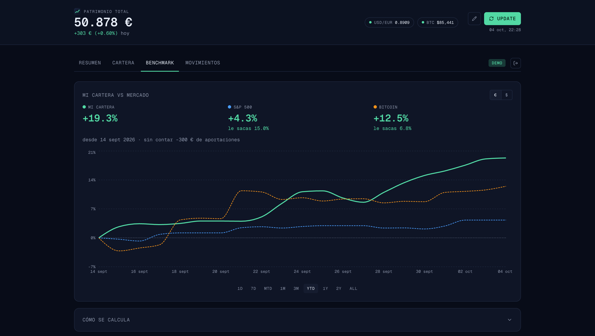

<div align="center">

# Wealth Tracker

**A private, self-hostable net-worth dashboard for people who hold crypto,
stocks and cash — and want to see all of it in one place.**

[**Live demo**](https://wealth-tracker-liart.vercel.app/demo) ·
[Hosted app](https://wealth-tracker-liart.vercel.app) ·
[Self-host](#self-host-in-5-minutes)


</div>

Bring your own Supabase, sign in with a one-time code, and track every
position with live prices from free public APIs — no broker linking, no
statement uploads. Built as a personal tool and as a portfolio piece: the UI
is in Spanish, code, schema and docs are in English.

---

## Highlights

- **Performance first.** The home screen opens with market P&L for the
  selected range (1D → ALL) and the net-worth evolution chart, in € or %.
  Contributions are placed at the moment they were recorded and excluded, so
  you see what the market did — not what you deposited.
- **Benchmark.** Time-weighted return of your portfolio against buy-and-hold
  S&P 500 and Bitcoin over the same range, all in € or all in $.
- **Long-term vs speculation.** Positions are split by role into a long-term
  core and a speculative pool, each with value, weight and cumulative P&L,
  plus a cap that tells you when the bets have grown too big.
- **One portfolio view.** Every position and cash account grouped by category:
  price, today's move, cumulative % vs your average cost and the exit target
  with how far it still is. A folded rebalance card says how many euros to buy
  or sell per category to get back to your targets.
- **Price-target alerts.** A push notification on your phone the day a
  position reaches its target (installed iOS app supported).
- **Journal with review and undo.** Queue buys, sells (with commissions),
  deposits, withdrawals and dividends; nothing touches the database until you
  apply them. External money is logged as a contribution so it never inflates
  performance. Any entry can be undone together with its cash counterpart.
- **Spanish tax summary.** Realized gains per year with FIFO (fees included),
  dividends and withholding, the two-month rule flagged and an orientative
  tax on the savings scale. CSV export for everything.
- **Interest accrual** on savings accounts, applied with one click.
- **Live prices from free APIs.** CoinGecko for crypto and Frankfurter (ECB)
  for USD/EUR need no key; Finnhub (free key) covers US stocks. Prices are only
  fetched when you press `UPDATE` (plus an optional daily snapshot).
- **Passwordless and multi-tenant.** Email one-time code (or magic link);
  Postgres row-level security isolates every user's rows.
- **Mobile-first and installable.** Bottom tab bar that hides while you
  scroll, a compact header, and your last tab and ranges remembered. Add it to
  the home screen and it runs full-screen with its own icon.
- **Public demo** with fictitious holdings and real prices. Everything works,
  nothing persists.

---

## Screenshots

### Resumen
Market performance, evolution chart, category breakdown, liquidity cushion
and plan (price targets and the alerts toggle).


### Cartera
Long-term vs speculation on top, then positions and accounts grouped by
category. Tap any row to edit it. Rebalancing and the scenario simulator are
folded at the bottom.


### Benchmark
Time-weighted return (contributions neutralised) against buy-and-hold S&P 500
and Bitcoin, with how far ahead or behind you are.



### Movimientos
Build operations from a form, review them, apply them in one go. Below: the
trade log (commissions, realized P&L), dividends, the FIFO tax summary and the
contribution history — each row can be undone, each list exported to CSV.


### Mobile


### Login
Email → one-time code. The code works inside the installed home-screen app,
where magic links can't (iOS gives it separate storage from Safari).


---

## How it works

| Concept | What it means |
|---|---|
| **Positions** | Tickers you hold: shares, optional average price (enables P&L), optional target price, category, platform and role. |
| **Accounts** | Cash or savings balances in EUR, with an optional annual rate for interest accrual. |
| **Snapshots** | Every `UPDATE` (and the daily cron) stores total, breakdown, prices and FX. Charts, range P&L and the TWR are computed from them. |
| **Contributions** | External money (salary, new savings). Neutralised at the moment they were recorded, so performance reflects the market only. |
| **Trades** | Log of every buy/sell applied from the Journal, with commission. Feeds the FIFO tax summary. |
| **Dividends** | Gross, withholding and the account they landed in. Count as return. |
| **Roles** | `core`, `tactica`, `cobertura`, `complemento`, `caja`, `residual` — each with a one-line rule. `tactica` is the speculative pool. |
| **Policy** | Liquidity target, monthly expenses and contribution amount live in `lib/policy.ts`; the speculation cap and category targets are per user. |

Prices are **never** fetched on page load. If a feed fails, the working
tickers still save a snapshot and the failures show in a banner; the pencil
icon lets you enter prices by hand.

---

## Stack

- **Next.js 16** (App Router) · **TypeScript** · **Tailwind CSS v4**
- **Supabase** — Postgres + Auth (email OTP / magic link) + RLS
- **Recharts** for charts · **Lucide** for icons
- **Prices:** CoinGecko · Finnhub · Frankfurter
- **Hosting:** Vercel

---

## Self-host in 5 minutes

### 1. Clone and install

```bash
git clone https://github.com/carleondel/wealth-tracker
cd wealth-tracker
npm install
```

### 2. Create a Supabase project

1. [supabase.com](https://supabase.com) → **New project**.
2. **SQL Editor** → run `supabase/schema.sql`, then each file in
   `supabase/migrations/` in order (`001` … `008`).
3. **Authentication → URL Configuration:** set Site URL to
   `http://localhost:3000` (your Vercel URL once deployed) and add
   `http://localhost:3000/**` to Redirect URLs.
4. **Authentication → Emails → Magic Link** template: add the one-time code
   to the body, for example:
   ```html
   <h2>Wealth Tracker</h2>
   <p>Tu código de acceso:</p>
   <p style="font-size:28px;font-weight:bold;letter-spacing:6px">{{ .Token }}</p>
   <p>O entra con este link: <a href="{{ .ConfirmationURL }}">Entrar</a></p>
   ```
   Do the same in **Confirm sign up** so first-time users also get a code.
5. **Project Settings → API:** copy the Project URL and the publishable key.

> Supabase's built-in email sender allows only a few emails per hour. For
> more than personal use, configure custom SMTP under **Authentication →
> Emails → SMTP Settings**.

### 3. Configure environment

```bash
cp .env.example .env.local
```

| Variable | Required | Notes |
|---|---|---|
| `NEXT_PUBLIC_SUPABASE_URL` | yes | Project URL |
| `NEXT_PUBLIC_SUPABASE_ANON_KEY` | yes | Publishable key (legacy anon JWT also works) |
| `FINNHUB_API_KEY` | for US stocks | Free at [finnhub.io](https://finnhub.io), 60 req/min. Server-side only. |
| `SUPABASE_SERVICE_ROLE_KEY` | for the daily cron | Supabase → Project Settings → API → `service_role`. **Secret**, server-side only. |
| `CRON_SECRET` | for the daily cron | Any long random string (`openssl rand -hex 32`). Vercel sends it to the cron route. |
| `NEXT_PUBLIC_VAPID_PUBLIC_KEY` | for target alerts | Web Push public key (`npx web-push generate-vapid-keys`). Public by design. |
| `VAPID_PRIVATE_KEY` | for target alerts | The matching private key. **Secret**, server-side only. |
| `VAPID_SUBJECT` | for target alerts | `mailto:you@example.com` — contact sent to the push services. |

### 4. Run

```bash
npm run dev
```

Open [localhost:3000](http://localhost:3000), enter your email, type the
code, and pick a starting template (or start empty).

### 5. Deploy

Import the repo in Vercel, add the same env vars, and add the production URL
to Supabase's Redirect URLs.

### 6. Daily snapshot (optional)

Prices are never fetched on page load — a snapshot is saved only when you
press **UPDATE**. To get a clean daily series for the history chart without
opening the app, `vercel.json` schedules a [Vercel Cron](https://vercel.com/docs/cron-jobs)
that calls `/api/cron/snapshot` every day at 22:00 UTC (after the US close).
The route fetches prices once for every ticker held by any user and inserts
one snapshot per user.

1. In Vercel → Project → Settings → Environment Variables add
   `SUPABASE_SERVICE_ROLE_KEY` and `CRON_SECRET` (see table above). Redeploy.
2. Vercel → Project → Settings → Cron Jobs shows the schedule and lets you
   run it manually. The response looks like
   `{"users":3,"saved":3,"tickers":18,"errors":[]}`.
3. To test locally:
   ```bash
   curl -H "Authorization: Bearer $CRON_SECRET" http://localhost:3000/api/cron/snapshot
   ```

Notes:
- The Hobby plan allows daily crons only, triggered within the scheduled hour.
- The service role key bypasses RLS, which is why the route needs it (it writes
  on behalf of every user). It is only read on the server and the route rejects
  any request without the matching `CRON_SECRET`.
- Side effect: the daily write keeps a free Supabase project from pausing
  after 7 days of inactivity.

### Price-target alerts (Web Push)

The same cron checks every position with a target price and sends a push
notification the first time the price reaches it (re-armed once it falls more
than 5% below, or when the target changes).

1. Run `supabase/migrations/008_push.sql`.
2. `npx web-push generate-vapid-keys` and add the three `VAPID` variables above
   in Vercel (and `.env.local` to test locally). Redeploy.
3. In the app: Resumen → Plan → "Avisarme al llegar al objetivo" → Activar. A
   test notification confirms it works. On iPhone this needs iOS 16.4+ and the
   app added to the home screen, opened from there.

---

## Starting templates

New accounts can seed one of three fictitious portfolios, then edit
everything from the UI:

| Template | Style | Positions |
|---|---|---|
| **Cripto-first** | BTC core, MSTR tactical, gold miners hedge, megacap tech | 14 |
| **Index ETF** | Bogleheads-style passive 4-fund | 4 (VOO, VXUS, BND, VNQ) |
| **Dividendos** | Dividend ETFs + aristocrats | 6 (SCHD, VYM, JEPI, O, KO, T) |

---

## Security model

- **Per-user isolation.** Every table has an `owner_id` referencing
  `auth.users`, and RLS enforces `auth.uid() = owner_id` on every read and
  write.
- **The public key is public by design.** Security comes from RLS, not from
  hiding the Supabase publishable key.
- **Server secrets stay on the server.** The Finnhub key is only used by the
  `/api/prices` route; the Supabase service role key only by
  `/api/cron/snapshot` (which requires `CRON_SECRET`) and `/api/push/test`
  (which only sends to the caller, identified by their Supabase session). The
  VAPID private key never leaves the server.
- **No analytics, no tracking.** The app only talks to your Supabase and the
  public price feeds.

### Using the hosted instance

[wealth-tracker-liart.vercel.app](https://wealth-tracker-liart.vercel.app) is
a portfolio deployment. Your rows are isolated from other users, but as the
Supabase admin I technically have database access, and there's no SLA or
guaranteed backups. If that matters to you, self-host — it's the same app.

---

## Project structure

```
app/
  page.tsx                    # auth gate (login vs dashboard)
  demo/page.tsx               # public demo, in-memory state
  api/prices/route.ts         # user-triggered prices (UPDATE button)
  api/cron/snapshot/route.ts  # daily snapshot for every user (Vercel Cron)
  api/benchmark/route.ts      # S&P 500 + BTC history for the Benchmark tab
  api/push/test/route.ts      # test notification to the caller's devices
  icon.tsx, apple-icon.tsx    # app icons rendered from the logo
  manifest.ts                 # PWA manifest
components/
  dashboard.tsx               # all state + handlers (live and demo)
  header.tsx                  # total, today's change, FX/BTC chips, UPDATE (+ compact bar on phones)
  login-screen.tsx            # email → one-time code
  tabs/overview.tsx           # Resumen
  tabs/portfolio.tsx          # Cartera
  tabs/benchmark.tsx          # Benchmark (TWR vs S&P 500 / BTC)
  tabs/journal.tsx            # Movimientos
  manual-op-form.tsx          # buy / sell / deposit / withdraw / dividend builder
  push-toggle.tsx             # enable price-target alerts on this device
  edit-position-modal.tsx, edit-asset-modal.tsx, update-prices-modal.tsx
  logo.tsx, ui/*
lib/
  calculations.ts             # P&L, TWR, breakdown, long-term vs speculation split
  policy.ts                   # targets, colors, role rules, speculation cap
  journal-ops.ts              # operation types + descriptions
  journal-undo.ts             # undo plans for trades, contributions, dividends
  tax.ts                      # FIFO lots, yearly gains, savings-scale estimate
  push-server.ts              # Web Push + target-alert logic (server only)
  prices-server.ts, benchmark.ts, use-persistent-state.ts
  seed.ts, demo.ts            # fictitious templates and demo history
  supabase.ts, types.ts, format.ts, csv.ts
public/
  sw.js                       # service worker: shows push notifications
supabase/
  schema.sql, migrations/
```

---

## Roadmap

- [ ] "Analyze with ChatGPT / Claude" — send an anonymized portfolio summary
      to your own subscription
- [ ] Prices for European-listed ETFs and stocks (Finnhub free covers US only)
- [ ] Per-user policy settings (liquidity target, contribution) from the UI
- [ ] User-defined categories
- [ ] Optional Face ID / Touch ID gate

---

## License

[MIT](./LICENSE). Issues and PRs are welcome, but the scope is intentionally
narrow — feel free to fork.
